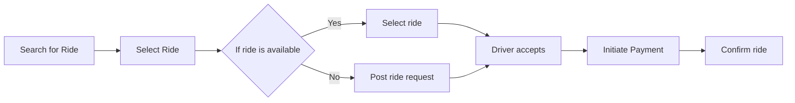

# A project to demonstrate key microservice components

## TODO:
- [ ] Usecase & process flow
- [ ] Development of services using grpc
- [ ] Event Driven
- [ ] Distributed Tracing
- [ ] Docker compose / k8s
- [ ] Vault
- [ ] Authentication & Authorization
- [ ] Caching
- [ ] Orchestration
- [ ] Choreography

### Ride-sharing

Create a microservice that implements the saga pattern for handling the ride-sharing process. This service would handle creating, updating, and canceling rides, and coordinating with other microservices for driver management and payment processing.

### Services:
- Ride Service
- Driver Service
- Payment Service
- Notification Service

