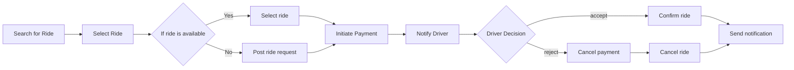

# A project to demonstrate key microservice components

## TODO:
- [x] Usecase & process flow
- [ ] Development of services using grpc
- [ ] Event Driven
- [ ] Distributed Tracing
- [ ] Docker compose / k8s
- [ ] Vault
- [ ] Authentication & Authorization
- [ ] Caching
- [ ] Orchestration
- [ ] Choreography

### Ride-sharing

Create a microservice that implements the saga pattern for handling the ride-sharing process. This service would handle creating, updating, and canceling rides, and coordinating with other microservices for driver management and payment processing.

### Services:
- Ride Service
    - Search available rides
    - Fetch past rides
    - Post a new ride
    - Delete a ride
    - View ride
    - Confirm ride
    - Cancel ride
- Driver Service
    -  Assign ride
    -  Accept/reject ride
- Payment Service
    -  Initiate payment
    -  Cancel/refund payment
- Notification Service
    -  Notify
